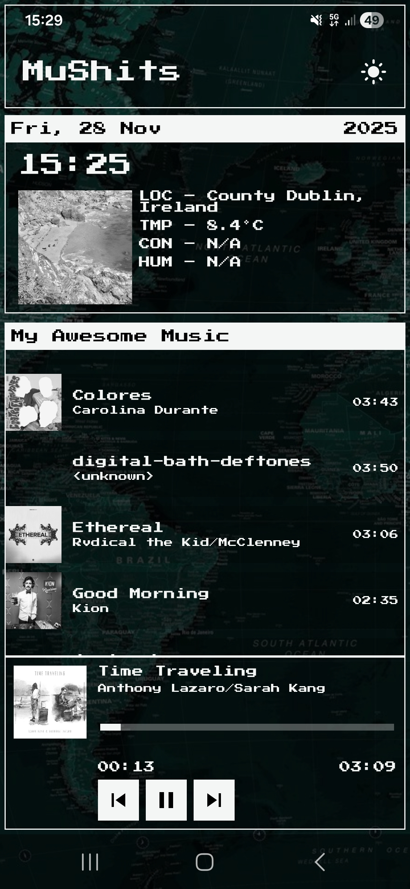
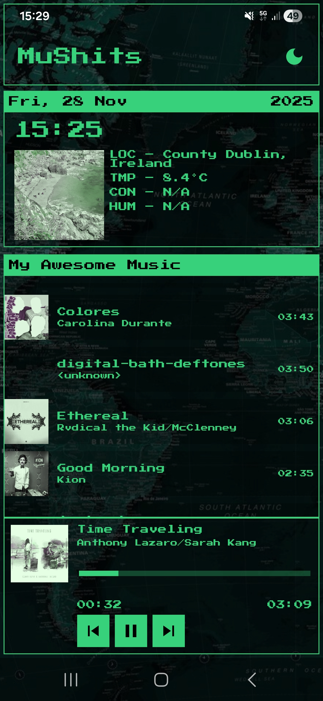

# MuShits

MuShits is a personal Android application designed as a retro terminal-style dashboard.  
It displays **weather**, **location**, **time**, and includes a **local music player**, all wrapped in an old-school CLI aesthetic.

The app comes with two visual modes:
- **White on Black** (classic terminal)
- **Green on Black** (CRT-style)

---

## 📸 Screenshots

### White/Black Mode

### Green/Black Mode

---

## 🎧 Music Player

- Plays **local audio files** using **Media3 ExoPlayer**
- Terminal-style playback interface
- Real-time music position updates
- Remembers **last played song and playback position**
- Background playback via `MediaSessionService`
- Auto-restore of last session on app launch

---

## 🌦 Weather & Location

- Retrieves current weather data
- Displays temperature and conditions
- Uses device location (with permission)
- Styled like a minimalist CLI weather tool

---

## 🕒 Time & Date

- Terminal-style digital clock
- Monospace, clean, minimal

---

## 🎨 Aesthetic

The UI is inspired by old terminal and CRT monitors:

- Monospaced fonts
- Minimal UI, no gradients
- White or green scanline-like style
- Simple layout, high readability

---

## 🛠 Tech Stack

- **Kotlin**
- **Jetpack Compose**
- **Media3 ExoPlayer**
- **MediaSessionService**
- **Datastore Preferences**
- **Coroutines + StateFlow**
- **Location Services**
- **Weather API**
- **Material 3**

---

## 📜 License

This is a personal project created for learning and experimentation.
